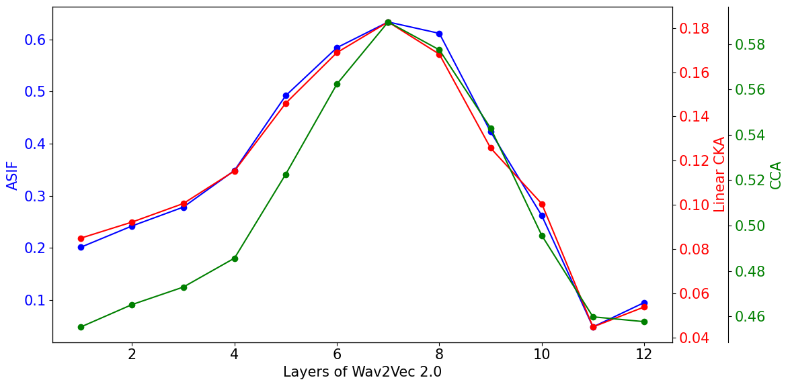
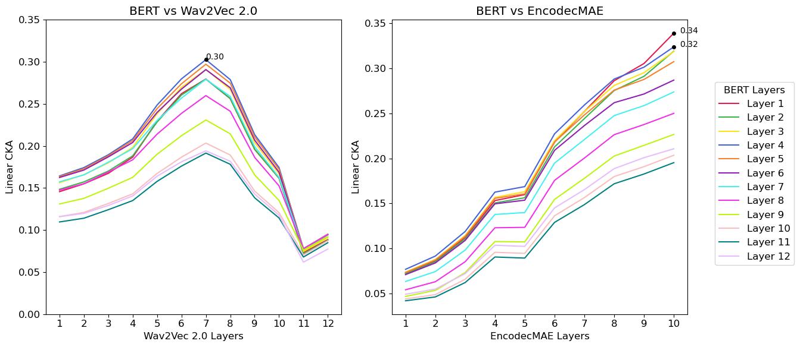
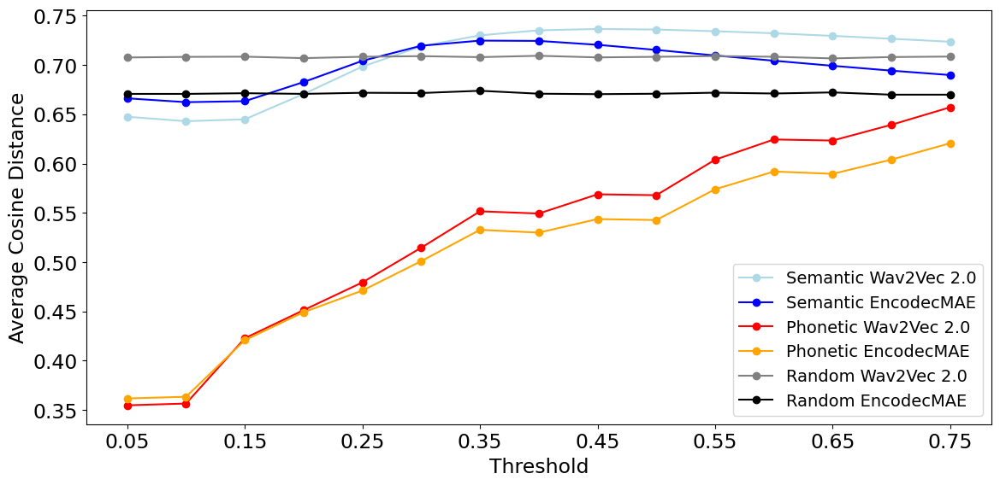

# Similarity Analysis of Word Representations from audio and text models

In this repository, you will find all the code to replicate the experiments from my thesis. The principal objective is to analyze the intermediate representations of words generated by different models, including audio and text models.

We work with the LibriSpeech dataset, which provides us with audio recordings and their corresponding transcriptions. To obtain the representation of every word, we consider different approaches taking into account the different models we use. For GloVe, since it already processes individual words, we simply pass each word from the transcription to obtain its pre-computed, single context-independent vector representation. In the case of BERT, we process the entire transcription and calculate the word representation as the average of the representations of the tokens that compose that word in a specific layer, resulting in a context-dependent representation. 

For audio models like Wav2Vec 2.0 and EncodecMAE, we process the complete audio, identify the frames corresponding to each word, and then average the representations of these frames. BEATs, however, processes 16x16 MelSpectrogram patches, where each patch contains information from 16 contiguous windows. We obtain the word representation by averaging the patches that contain the windows corresponding to that word.

To accurately identify the frames or windows corresponding to each word in the audio models, we rely on alignments. The concept of alignment refers to the precise temporal correspondence between the audio and the transcriptions. The alignments for LibriSpeech were calculated by Lugosch et al. (2019) using the Montreal Forced Aligner (McAuliffe et al., 2017), an open-source text and speech alignment system. These alignments are available on the site https://zenodo.org/records/2619474. For each audio recording, a `.TextGrid` file is provided, containing detailed information about the time intervals (the start and end time in seconds) for words and phonemes. For our purpose, we only consider the word alignments from these `.TextGrid` files.

## Key Experiments and Findings

This repository allows you to replicate several key experiments (all of them can be found in experiments folder) and explore important findings:

### 1. Comparison of Metrics Across Model Layers

- We compare how different metrics (CCA, Linear CKA, and ASIF) behave across the layers of Wav2Vec2, comparing with the representations generated by GloVe.
- This analysis provides insights into how representation similarity evolves through the layers of the model and allows us to determine if the different metrics preserve consistent behavior.



### 2. Cross-Model Representation Similarity

- You can run a specific metric (Linear CKA or ASIF) with a pair of models (Wav2Vec 2.0, EncodecMAE, BERT, GloVe, BEATs) to understand how similar their representations are and highlight the differences.
- For example, when we run Linear CKA for EncodecMAE-BERT and Wav2Vec 2.0-BERT, we get this results:



- From such analyses, we can conclude that the models are processing information differently internally. This type of analysis can be done for different models trained with different datasets and using different metrics. You can also compare the same model across different training stages or fine-tuning iterations.

### 3. Phonetic vs. Semantic Encoding in Audio Models

- Using the ASIF metric (which works as a retrieval method), we discovered that when analyzing the words retrieved from the representations of an audio model to the representations of a text model, they were more similar phonetically than semantically.
- You can replicate experiments to investigate whether words are encoded more by phonetic or semantic features in audio models, especially using Wav2Vec and EncodecMAE.



- This experiment provides insights into how audio models process and represent language.


<details><summary>More details on how to run and replicate results</summary>

## Description

To compare how the representations change across the models, the 'dev clean' subset of the LibriSpeech database will be used. This subset contains 2703 audios with their respective transcriptions.

## Folder Structure

- **./datasets**: Contains the following folders:
  - **alignments**: Alignments of the audios and transcriptions.
  - **librispeech-clean-16k**: Audios in 16kHz format.
  - **librispeech-clean-24k**: Audios in 24kHz format.
  - Within each of these folders, there is a 'dev-clean' subfolder with the corresponding data.

- **./experiments**: Here, the embeddings generated for each audio are stored.

- **./layer-analysis**: This is the main directory of the repository from which all the experiment runs are executed.

## How to Run the Experiments

1. **Prepare the environment**: Install all necessary dependencies by running:
    ```bash
    pip install -r requirements.txt
    ```
2. **Download the data**: Place the LibriSpeech data in the `./datasets/librispeech-clean-16k/dev-clean` and `./datasets/librispeech-clean-24k/dev-clean` folders.

3. **Run the experiments**: From the `./layer-analysis` folder, run the corresponding scripts to generate and analyze the representations.

## How to get the results

First, we need to obtain the alignments for each of the audios. To do this, we must run the `alignments_and_trans.py` script, located in the `alignments` folder. This script accepts arguments such as 'stride', 'sample_rate', and the 'path' where the files with the alignments are located. The 'sample_rate' argument can be 16 or 24, indicating the audio's sampling frequency. The 'stride' specifies the time interval between captured information windows.

```bash
python3 alignments/alignments_and_trans.py --sample_rate 16 --stride 10 --path '../datasets/alignments'
```

We aim to obtain the embeddings for each word, for which we need to know the frames containing them. Therefore, it is crucial to preserve each of the JSON files generated for the following steps, and it is very important to generate a file according to the configuration of the model we are using.


### Get the Embeddings

For these analyses, we are only considering text models such as BERT and GloVe, and audio models such as Wav2Vec 2.0 (speech), EncodecMAE, and BEATs.

**Text models**

For text models, we can send any alignments file because they only need the words from the audio, not their alignment.

**Glove**

```bash
python3 embeddings/glove_embedding.py --path 'alignments/audio_alignments_20_16.json'
```

**BERT**

```bash
python3 embeddings/nlp_embedding.py --model bert-base-uncased --path 'alignments/audio_alignments_20_16.json' --device 'cuda'
```

**Audio models**

We consider models that were pretrained for speech tasks as well as more general audio tasks. In the case of models trained for ASR, we used wav2vec2, but the code is designed to support any speech processing model implemented in s3prl. 
We also consider models that were trained for general audio tasks. Currently, the code supports the models `encodecmae_base` and `BEATs_iter3`, but it can be easily adapted to calculate the embeddings of any model implemented at https://github.com/mrpep/easyaudio. 

It is crucial to use the JSON file corresponding to the alignment with the appropriate sampling frequency and stride for each specific model.

**Speech**

```bash
python3 embeddings/speech_embedding.py --model wav2vec2_large_960 --path 'alignments/audio_alignments_20_16.json' --device 'cuda'
```

**General Audio**

```bash
python3 embeddings/audio_embeddings.py --model encodecmae_base --path 'alignments/audio_alignments_13.33_24.json' --device 'cuda'
```

Once we have obtained the embeddings for each word of each file, we can assemble the "matrix" that contains all this information. This is done by executing:

```bash
python3 embeddings/matrix_embeddings.py --layer 5 --model 'wav2vec2' --words_path 'words_in_order1.json'
``` 

Where we need to specify the layer we want to represent, as well as the `words_path` that indicates the common words, that is, those that have representation, across all models.

### Experiments


**Centered Kernel Alignment (CKA):**

We calculate Linear_CKA(X, Y) where X and Y are the representations of each word for a specific model and layer. The following command returns this value for all combinations of layers of the two given models:

```bash
python3 experiments/experiment_CKA.py --model1 'bert-base-uncased' --layer1 12 --model2 'wav2vec2_large_960' --layer2 24
``` 

**ASIF:**

We explore a technique that extends beyond traditional metrics like CCA and CKA, which indicate similarity between representation spaces but lack detailed insights into how specific words are represented by different models. ASIF offers a deeper interpretation by evaluating the proximity of corresponding audio and text representations in a shared space. The experiment focuses on calculating the zero-shot accuracy using two layers from an audio model and a text model, further quantifying how these modalities converge in a shared representational space.

The `experiment_ASIF.py` script is designed to perform embedding retrieval experiments. The retrieval results, including the values and indices of the retrieved embeddings and the indices of the deleted rows, are stored in a JSON file. 

```bash
python experiments/experiment_ASIF.py --path_layer1 '../experiments/layers/embeddings_layer6_wav2vec2.json' --path_layer2 '../experiments/layers/embeddings_layer0_glove.json' --k 600 --p 4 --keys 'words_in_order1.json'
``` 

It is important to note that ASIF has hyperparameters (`k` and `p`) that need fine-tuning to optimize performance.

</details>
